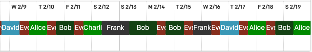

# pd-shifts

This is a command-line tool to generate a CSV tally of on-call shifts per user for one or more PagerDuty schedules.

It goes from this:



To this ⬇️

| User    | Weekday Shifts | Weekend Shifts | Total Shifts |
|---------|----------------|----------------|--------------|
| Alice   | 2              | 1              | 3            |
| Bob     | 3              | 1              | 4            |
| Charlie | 1              | 0              | 1            |
| David   | 2              | 0              | 2            |
| Eve     | 9              | 0              | 9            |
| Frank   | 1              | 1              | 2            |

## Assumptions

This tool is designed to count shifts according to a couple of unique assumptions. You'll likely need to have the same assumptions in order to find this tool helpful:

- The length of shifts are irrelevant; we only care about the number of distinct shifts each user has completed.
- We determine whether an on-call shift is a weekday or a weekend shift by the time that the shift started, irrespective of when the shift ends. For example, a Fri 17:00 - Sat 09:00 shift would be counted as a weekday shift.
- All shifts that are started on a UK bank holiday are also counted as 'weekend' shifts.

## Installation

You can install the `pd-shifts` tool directly from this repository:

```sh
$ cd /path/to/pd-shifts
$ npm install -g .
```

## Usage

In order to use the tool, you must have:

* **A valid PagerDuty API token:** you can get one by going to the "My Profile" page in the PagerDuty web interface, clicking on the "User Settings" tab, and then clicking the button to "Create API User Token".
* **The ID(s) of the PagerDuty schedules you want to use:** you can get this directly from the URL when viewing a schedule in the PagerDuty web interface. For example, for this schedule https://organisation.pagerduty.com/schedules#PABCD12, the schedule ID is `PABCD12`.

Once you have these, you can plug them into the tool to generate your CSV:

```sh
$ pd-shifts \
    --token abcdeFGhIJklMn123456 \
    --schedule PABCD12 \
    --schedule PQRST34 \
    --from 2022-01-01 \
    --until 2022-02-01 \
    > shifts.csv
```

### Options

- `-f, --from` - The start date of the export (inclusive)
- `-u, --until` - The end date of the export (exclusive)
- `-t, --token` - The PagerDuty API token
- `-s, --schedule` - ID of the PagerDuty schedule to count shifts from. Can be specified multiple times for multiple schedules.
- `-l, --list-shifts` - Output a JSON listing of the shifts for each user, instead of the regular CSV output. Helpful for debugging.
- `--max-shift-length` - The maximum length of a single shift, in hours. Default: 24 hours.
    - This is needed because the PagerDuty API 'squashes' together multiple consecutive shifts, and so we need a way of determining at what point to 'chop' them back up again.

## A note on bank holidays

The bank holidays are determined from the `data/bank-holidays.json` file, which is sourced from https://www.gov.uk/bank-holidays.json. In the future, a fresh copy of this JSON may need to be fetched in order to pull down new bank holidays:

```sh
$ curl "https://www.gov.uk/bank-holidays.json" > data/bank-holidays.json
```
